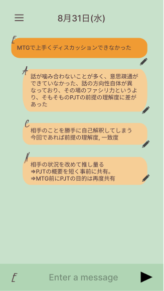

# Reflection App
チャット形式で日々の振り返りを行うためのiOSアプリ

## DEMO

[Figma](https://www.figma.com/file/Hoqn0h6B3zDAGtcRuOfQGm/YWTReview?node-id=0%3A1)

## Features
* 「EASN」という日々の経験から自己を振り返るフォーマットを利用
* iOS(iPhone SE3, iPad mini6)とWebに対応しているため場所や時間を選ばずに入力が可能
* （今後は）対話形式のUIに変更して、より”振り返り”の心理的ハードルを下げる

### ◇EASN
* E（経験）
    * 具体的な経験
    * 成功,失敗に関わらず特徴的な経験
* A（行動）
    * 行動レベルの振り返り
    * その経験に際してどのような行動を取っていたか？
    * これまではどのような行動を取っていたか？
* S（スタンス）
    * スタンスレベルの振り返り
    * その行動の前提としてある自身のスタンスは何か？
    * 何を感じて、考えて、その行動を取っていることが多いか？
* N（ネクストアクション）
    * スタンスを鑑みた上での次回の打開行動
    * スタンスは自身の本質でもあるため蔑ろや否定は行わない
    * 失敗の経験であれば改善行動、成功の経験であれば転用可能な事柄

※ 開発者が独自に提唱している振り返りフォーマットです

## Architecture
### ◇FE
* Flutter
### ◇BE
* php(Laravel)
    * API
    * バッチ（artisan）
### ◇Infra
* Amazon Lightsail
    * LAMP
